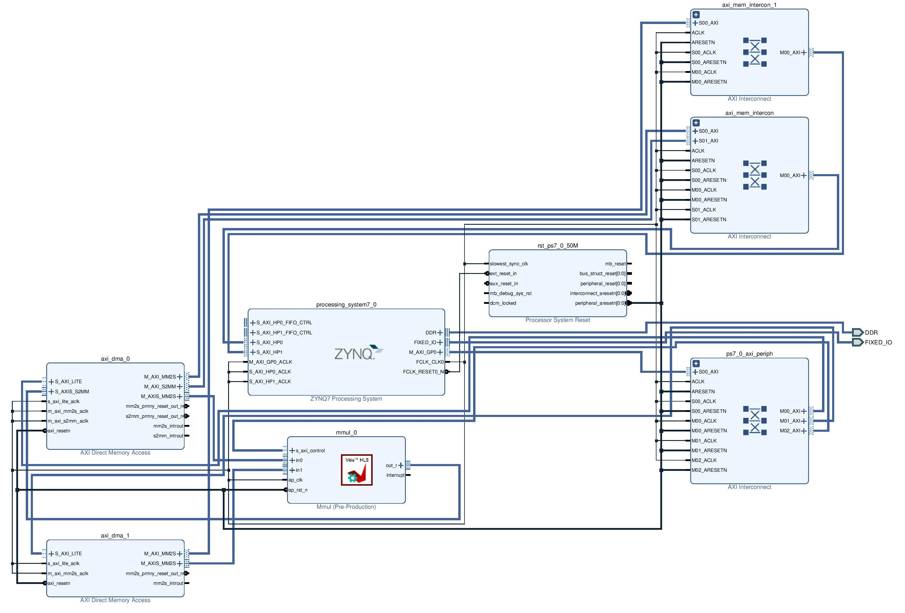

> Mostly forked from [this example](https://github.com/twaclaw/matmult)
> > Difference: now we take advantage of hardware parrallism; perf. gains of ~2ms when the kernel is run a > 100 times
> > Gains of 2x-5x compared to software version

