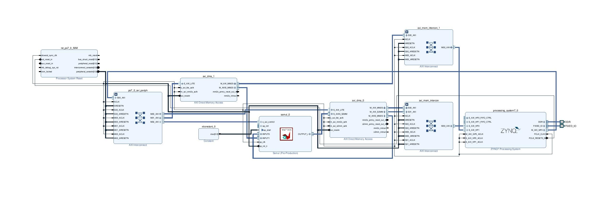

```
Here we take two vectors and add them pairwise on hardware:

i_0 = (i_00, i_01 ...)
i_1 = (i_10, i_11 ...)

o = i_0 + i_1
```

> For 1 million values, the acceleration is ~10x
> > The execution gains increase exponentially with the amount of data processed